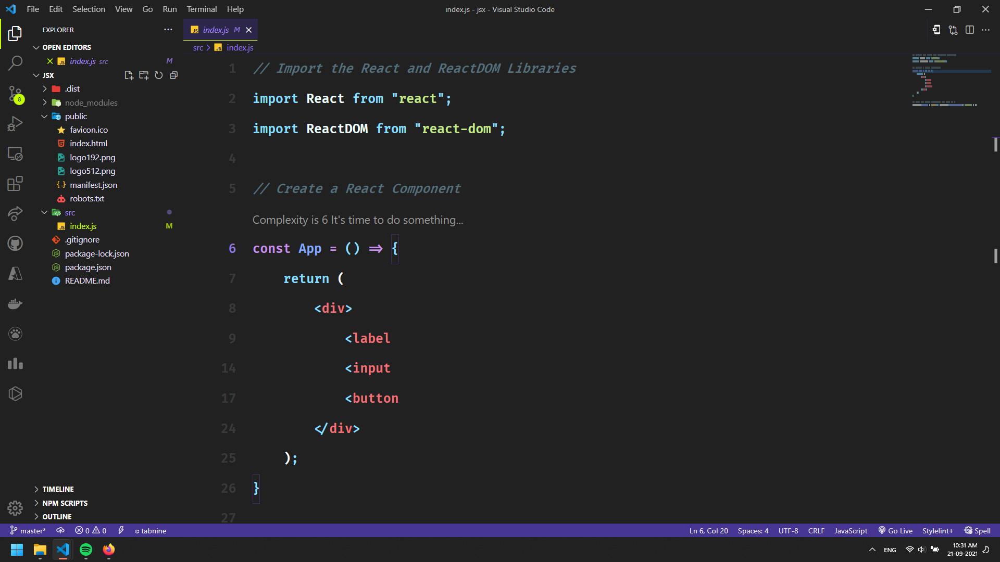
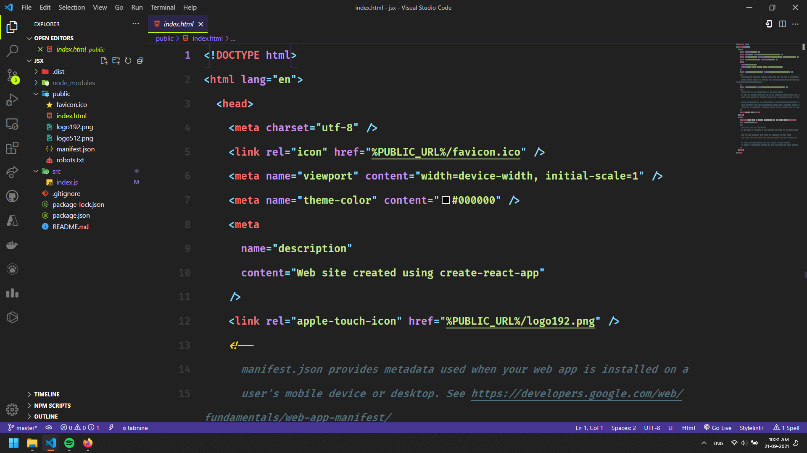

<h1 style="margin-top: 20px; font-weight: 900;">CODE DARK</h1>
<h2 style="margin-top: 20px; font-weight: 500;">Dark Theme for VS Code</h2>

This is a beautifully crafted theme by Team Materilio, and has a minimal design and an elegant look.

<h2 style="margin-top: 20px; font-weight: 500;">Screenshots </h2>

  

  
  

### For more information

<h2 style="margin-top: 20px; font-weight: 500;">Hi 👋 I am Allen!</h2>

I am a developer who is passionate about stuff like android and the latest Tech. Few tech stacks that I enjoy working on are Java, C++, Dart, Node, Express , Python, OpenCV and much more.

-   [Materilio Website](https://materilio-allen.firebaseapp.com)
-   [Allen Benny (Author)](https://www.linkedin.com/in/allen-benny)

  

**Have a Nice Day! Tschuss!**
